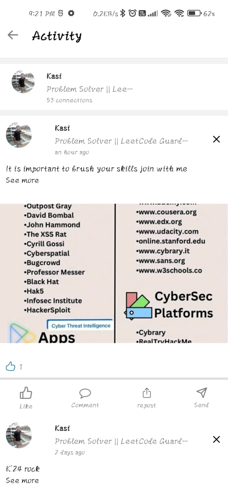

<div align='center'>


<h1>LinkedIn</h1>
<p>Hey there! Welcome to my linkedIn clone application for mobile, where you can do all the cool stuff you love about LinkedIn right from your phone. Made it with React Native and Expo Router to keep things super easy. Here's what you can do: Show off your skills(Profile ManageMent), meet awesome people (Network building), find your dream job (Search Job), chat with friends (Messaging), and stay updated with the latest news and trends in your field—all in our app! It's here to give you that LinkedIn vibe</p>

<h4> <span> · </span> <a href="https://github.com/kasinathansj@gmail.com/llinkedin-clone/blob/master/README.md"> Documentation </a> <span> · </span> <a href="https://github.com/kasinathansj@gmail.com/llinkedin-clone/issues"> Report Bug </a> <span> · </span> <a href="https://github.com/kasinathansj@gmail.com/llinkedin-clone/issues"> Request Feature </a> </h4>


</div>

# :notebook_with_decorative_cover: Table of Contents

- [About the Project](#star2-about-the-project)
- [Contact](#handshake-contact)
- [Acknowledgements](#gem-acknowledgements)


Uploading freecompress-Screenrecorder-2024-03-05-19-48-04-695.mp4…


## :star2: About the Project
.jpg>)

<h2>Demo</h2>
<video controls src="freecompress-Screenrecorder-2024-03-05-19-48-04-695.mp4" style="display: block; margin-left: auto; margin-right: auto;" title="Demo"></video>


### :camera: Screenshots
| Network Page | Job Detail Page | Activity Page |
|:------------:|:------------:|:------------:|
|  |  |  |

| Request Send Page | Drawer | Chatting Page |
|:------------:|:------------:|:------------:|
|  |  |  |

| Connection Page | Create Post | Message People |
|:------------:|:------------:|:------------:|
|  |  |  |

| Post Page | Feed Page | Manage Your Network Page |
|:-------------:|:-------------:|:-------------:|
|  |  |  |

| Job Search Page | Request Received Page | Search People |
|:-------------:|:-------------:|:-------------:|
|  |  |  |

| Profile Page | Profile Page | Notification Page |
|:-------------:|:-------------:|:-------------:|
|  |  |  |


### :space_invader: Tech Stack
<details> <summary>Client</summary> <ul>
<li><a href="https://expo.dev/">Expo(React Native)</a></li>
</ul> </details>
<details> <summary>Server</summary> <ul>
<li><a href="https://expressjs.com/">Express</a></li>
</ul> </details>
<details> <summary>Database</summary> <ul>
<li><a href="https://www.mongodb.com/atlas/database">MongoDB</a></li>
</ul> </details>

### :dart: Features
- Create your professional profile
- connect with like-minded professionals
- search and apply for jobs
- chat with connections
- post , comment , like features


## :toolbox: Getting Started

### :running: Run Locally

Clone the project

```bash
https://github.com/kasi-sj/linkedin-clone
```
Clone the Repo
```bash
https://github.com/kasi-sj/linkedin-clone
```
Enter the Project Directory
```bash
cd linkedin-clone
```
Install the dependencies
```bash
npm i
```
Add the Environmental Variables
```bash
EXPO_PUBLIC_BACKEND_URL,
EXPO_PUBLIC_FIREBASE_API_KEY,
EXPO_PUBLIC_FIREBASE_AUTH_DOMAIN,
EXPO_PUBLIC_FIREBASE_PROJECT_ID,
EXPO_PUBLIC_FIREBASE_STORAGE_BUCKET,
EXPO_PUBLIC_FIREBASE_MESSAGING_SENDER_ID,
EXPO_PUBLIC_FIREBASE_APP_ID,
```
Run the App in development server
```bash
npm start
```


## :handshake: Contact

kasinathansj@gmail.com

Project Link: [https://github.com/kasi-sj/linkedin-clone](https://github.com/kasi-sj/linkedin-clone)

## :gem: Acknowledgements

Use this section to mention useful resources and libraries that you have used in your projects.

- [Expo]()
- [Redux]()
- [Socket.io]()
- [Expo-router]()
- [Express]()
- [MongoDB]()
- [Prisma]()
- [FireBase]()
